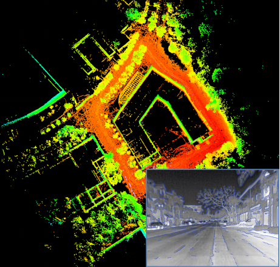

# EIL-SLAM:Depth Enhanced Edge-based Infrared-LiDAR SLAM

This repository contains code for a Depth enhanced edge-based Infrared-LiDAR SLAM system for ROS. It integrates the open source works of [rebvo](https://github.com/JuanTarrio/rebvo) and [Lego-LOAM](https://github.com/RobustFieldAutonomyLab/LeGO-LOAM) to generate this work.The system takes in point cloud from a Velodyne VLP-16 Lidar and thermal infrared images as inputs. It output 6D pose estimation in all-day.

<p align='center'>
    
</p>

### System requirements

-- C++11

-- Linux, X11, v4l2

-- OpenGL development libraries (GL,GLU,glut)

-- PCL1.7

-- TooN 2.2 mathematical library (http://www.edwardrosten.com/cvd/toon.html - ZIP provided in the repo)

-- Lapack (for advanced TooN functions)

-- LibAV (Video Codecs)

-- Libgd (sudo apt-get install libgd-dev)

### Compiling

#### Compiling TooN2.2

```bash
./configure && make && sudo make install
```

#### Compiling Rebvo

```bash

cd rebvo/rebvolib/

/usr/lib/x86_64-linux-gnu/qt5/bin/qmake -spec linux-g++-64 -o Makefile rebvolib.pro

cd rebvo/

/usr/lib/x86_64-linux-gnu/qt5/bin/qmake -spec linux-g++-64 -o Makefile rebvo.pro

make REBVOFLAGS=-m64
```

#### Compiling Calc2.0

The system use the Calc2.0 to infrared scene recognition. To get start, refer the [Calc2.0](https://github.com/rpng/calc2.0) to configure the environment and train the model.

#### Compiling Ros

```bash
cd rebvo/ros/

catkin_make`
```

### Run the package

1. configure the related parameters in rebvo/ros/src/thermal_loam/cfg/rebvo_thermal.yaml
2. Run the launch file:

```bash
roslaunch rebvo run.launch
```

3. Play existing bag files:

```bash
rosbag play *.bag --clock --topic /velodyne_points /camera/image_raw 
```

if completing the configuration of Calc's environments, run the python file:bash

```bash
cd calc2.0/
python loopDetector.py
```
